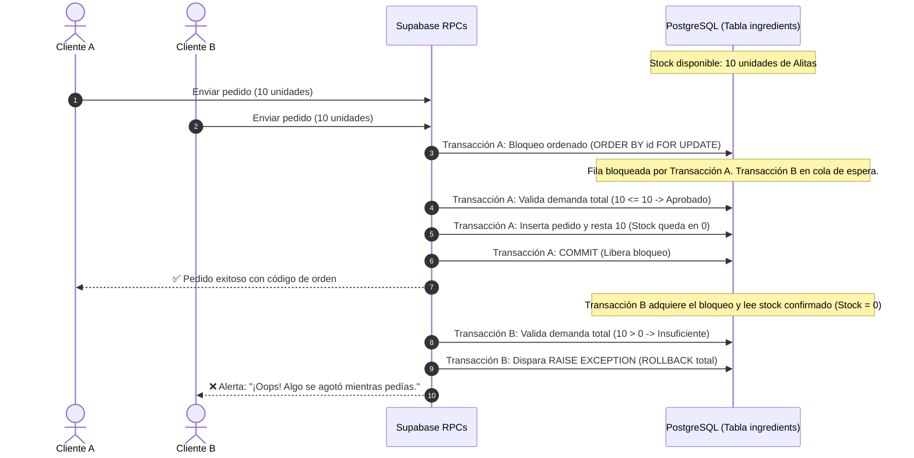

# Reporte Integral de Auditoría y Optimización: Inventario, Recetas, Pedidos y Concurrencia

**Fecha:** 1 de Septiembre de 2026  
**Proyecto:** EA-Panel (Entre Alas)  
**Entorno de Base de Datos:** Supabase PostgreSQL (`xvstqhvooabljhhfmuas`)  
**Módulos Afectados:** Inventario, Recetas, Catálogo de Productos, Sincronización de Pedidos y Checkout (Admin y Cliente)

---

## 1. Resumen Ejecutivo de la Intervención

Se completó con éxito la implementación de los **4 puntos críticos** de optimización e integridad transaccional:

1. **[PUNTO 1] Validación y Consolidación de Stock en Checkout (`create_order_with_stock_check`):**
   - Agrupación y suma de demanda por ingrediente en todo el carrito para evitar inventarios negativos al comprar múltiples platillos con insumos compartidos.
   - Orden determinista (`ORDER BY ing.id ASC`) con `FOR UPDATE OF ing` para prevenir bloqueos mutuos (*Deadlocks*) en concurrencia.
2. **[PUNTO 2] Guardado Atómico de Productos y Recetas (`save_product_with_recipe`):**
   - Creación de RPC transaccional que consolida el guardado de datos del producto y el reemplazo de su receta en un solo paso atómico en PostgreSQL, evitando pérdidas de datos por cortes de conexión en el frontend.
3. **[PUNTO 3] Sincronización de Stock al Editar Pedidos en Admin (`update_order_with_stock_sync`):**
   - Reversión atómica del stock de los ítems anteriores y validación/deducción del nuevo stock requerido para pedidos activos modificados desde el panel de administración.
4. **[PUNTO 4] Bloqueo Visual Proactivo de Productos Agotados en el Menú (`get_active_menu_products`):**
   - RPC segura (`SECURITY DEFINER`) que computa el estado `is_out_of_stock` para el menú del cliente sin exponer costos ni recetas privadas.
   - Integración visual en el menú y modal del producto con distintivo *"Agotado"*, deshabilitación de botones de compra y protección al añadir al carrito.

---

## 2. Detalle Técnico de los 4 Puntos Implementados

### 2.1 [PUNTO 1] RPC `create_order_with_stock_check`
* **Archivo de Migración:** `supabase/migrations/20260901164500_fix_create_order_with_stock_check_aggregation.sql`
* **Comportamiento:**
  - Desempaqueta `p_cart_items` y agrupa por `rec.ingredient_id` sumando `SUM(ci.quantity * rec.quantity_used)`.
  - Bloquea exclusivamente las filas de los insumos en orden ascendente de ID.
  - Si el stock es insuficiente, lanza `RAISE EXCEPTION` y aborta la transacción sin tocar el inventario.
  - Inserta el pedido y sus ítems, y descuenta el stock en un solo `UPDATE ... FROM ...`.

### 2.2 [PUNTO 2] RPC `save_product_with_recipe`
* **Archivo de Migración:** `supabase/migrations/20260901165000_add_atomic_save_product_with_recipe_rpc.sql`
* **Archivo Frontend Modificado:** `src/pages/Products.jsx`
* **Comportamiento:**
  - Realiza el `INSERT ... ON CONFLICT (id) DO UPDATE` del producto en `products`.
  - Elimina las recetas previas en `product_recipes` e inserta la nueva lista de ingredientes en una sola transacción PostgreSQL.

### 2.3 [PUNTO 3] RPC `update_order_with_stock_sync`
* **Archivo de Migración:** `supabase/migrations/20260901170000_add_update_order_with_stock_sync_rpc.sql`
* **Archivo Frontend Modificado:** `src/components/EditOrderModal.jsx`
* **Comportamiento:**
  - Si la orden no está cancelada, calcula el consumo de los `order_items` actuales y los suma de regreso a `ingredients.current_stock`.
  - Valida que exista stock suficiente para los nuevos ítems solicitados por el administrador.
  - Descuenta el nuevo stock y reemplaza los ítems en `order_items` actualizando el total y la programación de la orden.

### 2.4 [PUNTO 4] RPC `get_active_menu_products` y Experiencia de Usuario
* **Archivo de Migración:** `supabase/migrations/20260901170500_add_get_active_menu_products_rpc.sql`
* **Archivos Frontend Modificados:**
  - `src/context/ProductContext.jsx`: Carga el catálogo invocando `get_active_menu_products` y propaga `is_out_of_stock`.
  - `src/pages/Menu.jsx`: Muestra la etiqueta *"Agotado"*, deshabilita el botón de añadir y previene adiciones inválidas al carrito.
  - `src/pages/Menu.module.css`: Estilos visuales `.outOfStockBadge` y `.cardActionButtonOutOfStock`.
  - `src/components/ProductModal.jsx` y `ProductModal.module.css`: Bloqueo del selector de cantidad y botón *"Producto Agotado"*.

---

## 3. Matriz de Concurrencia y Resistencia a Fallos

---

## 4. Archivos Creados y Modificados en el Repositorio

| Archivo | Tipo | Descripción |
| :--- | :--- | :--- |
| `supabase/migrations/20260901164500_fix_create_order_with_stock_check_aggregation.sql` | Migración SQL | RPC `create_order_with_stock_check` con agregación y anti-deadlock |
| `supabase/migrations/20260901165000_add_atomic_save_product_with_recipe_rpc.sql` | Migración SQL | RPC `save_product_with_recipe` para guardado atómico de recetas |
| `supabase/migrations/20260901170000_add_update_order_with_stock_sync_rpc.sql` | Migración SQL | RPC `update_order_with_stock_sync` para sincronización de stock en edición |
| `supabase/migrations/20260901170500_add_get_active_menu_products_rpc.sql` | Migración SQL | RPC `get_active_menu_products` con cálculo de disponibilidad proactiva |
| `src/pages/Products.jsx` | Código React | Integración con `save_product_with_recipe` |
| `src/components/EditOrderModal.jsx` | Código React | Integración con `update_order_with_stock_sync` |
| `src/context/ProductContext.jsx` | Código React | Soporte de `is_out_of_stock` en el catálogo activo |
| `src/pages/Menu.jsx` | Código React | Renderizado y bloqueo de productos agotados |
| `src/pages/Menu.module.css` | Estilos CSS | Clases visuales para productos agotados |
| `src/components/ProductModal.jsx` | Código React | Deshabilitación de compra en modal de detalle |
| `src/components/ProductModal.module.css` | Estilos CSS | Estilos de botón y controles agotados en modal |
| `docs/reporte-inventario-recetas-pedidos.md` | Documentación | Registro de trazabilidad y especificación técnica |

---

## 5. Conclusión
El sistema cuenta ahora con **integridad transaccional completa y robusta** en todos los niveles:
- **Base de Datos:** Cero posibilidades de inventarios negativos o inconsistencias por concurrencia.
- **Panel Administrativo:** Creación y edición segura de productos, recetas y pedidos.
- **Experiencia de Cliente:** Información clara sobre la disponibilidad de productos en tiempo real.
